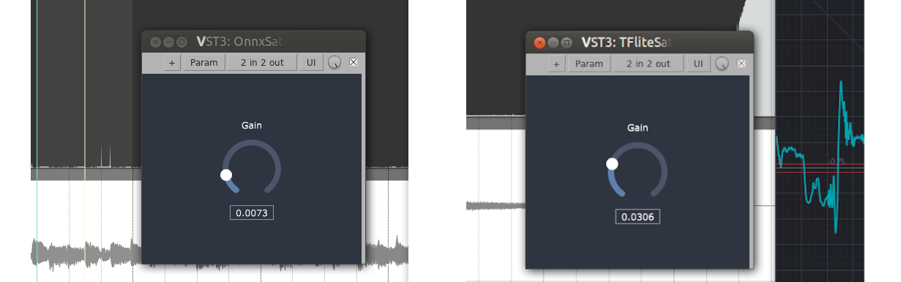

# Elk Audio OS - AI Tutorial

This repository contains *clean templates* and project *examples* to compile VST plugins with **neural networks**. A specific focus is given to deployment to embedded computers with the Elk Audio OS, a real-time Linux-based operating system for low latency embedded audio processing.  
The repository is meant to accompany the following scientific paper:  
  
*Domenico Stefani, Luca Turchet **"A Guide to Real-Time Embedded Deep Learning Deployment for Elk Audio OS"** in International Symposium on the Internet of Sounds (IS2), Pisa, Italy Oct 2023 (Accepted)*

The paper will soon be available [here](https://domenicostefani.com/phd_research.html#2023IS2-Guide)

## Guide
You can find the guide in the [guide/README.md](guide/README.md) file.

## Repository Description 

This project is meant to be a guide to deploying neural networks in VST plugins, with a specific focus on Elk Audio OS.  
Elk audio OS is a real-time Linux-based operating system for low latency embedded audio processing, which allows running VST plugins on several embedded computers.

This guide provides instructions for two different **Inference Engines**:
 - [ONNXruntime](https://onnxruntime.ai/docs/)
 - [TensorFlow Lite](https://www.tensorflow.org/lite)

The folders in this repository are of two types: templates and examples.
The templates are meant to be used as a starting point for new projects, while the examples are meant to be used as a compilation and execution test.
Every subfolder provides configuration files to compile the project for both a regular Linux Laptop/Desktop machine (`x86_64` architecture) and for the Elk Audio OS target (a Raspberry Pi 4 running Elk Audio OS, `aarch64` architecture).

The repository contains the following folders:
 - `ONNXruntime-VSTplugin-template/`
 - `ONNXruntime-example/`
 - `TFlite-VSTplugin-template/`
 - `TFlite-example/`

  
*Domenico Stefani, 2023*
