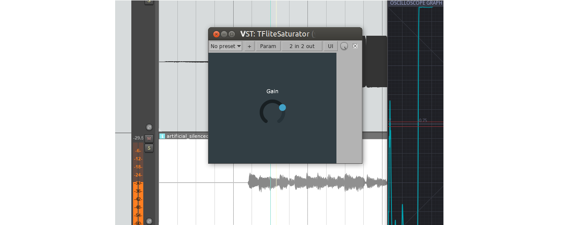

# TFlite-example

Example of VST plugin with TensorFlow Lite inference.

The model in `sample_data/saturation_model.tflite` is a simple saturation model that takes each sample, applies a gain and saturates it. 

This is part of the [elk-audio-AI-tutorial](https://github.com/domenicostefani/elk-audio-AI-tutorial/) and the plugin can be compiled for both regular x86-64 Linux PCs and a Raspberry Pi with Elk Audio OS. Refer to the tutorial for more information.

*2023 Domenico Stefani*