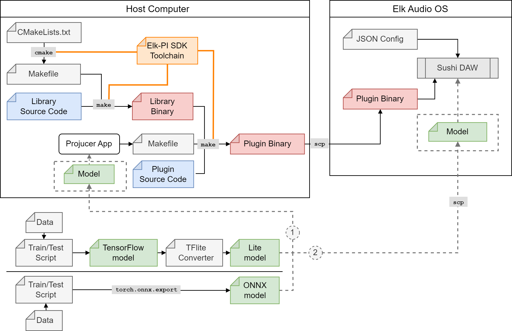
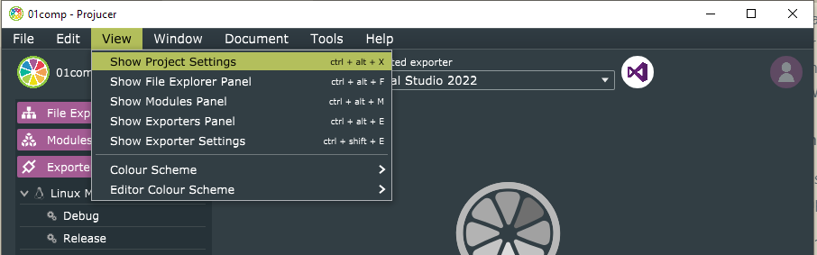
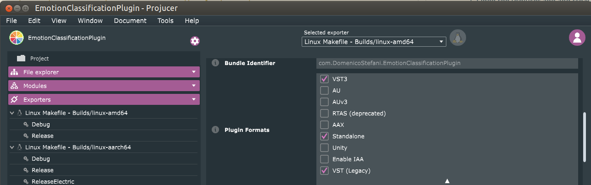
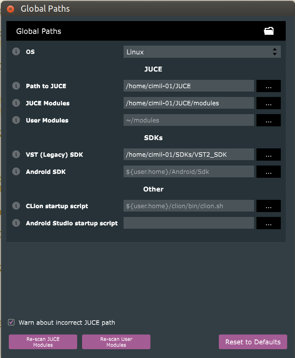
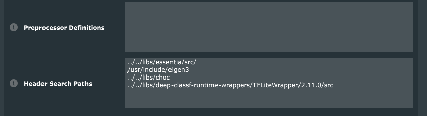
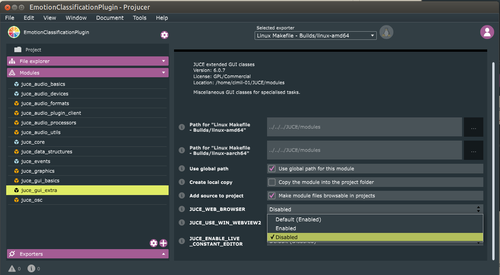
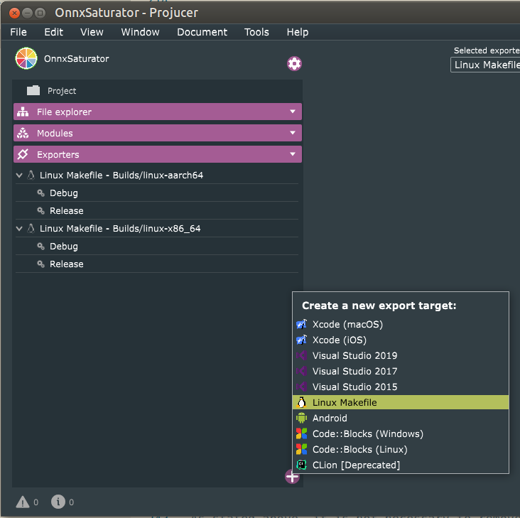
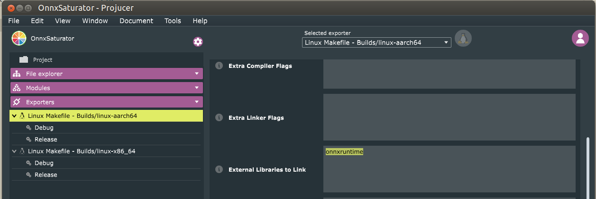
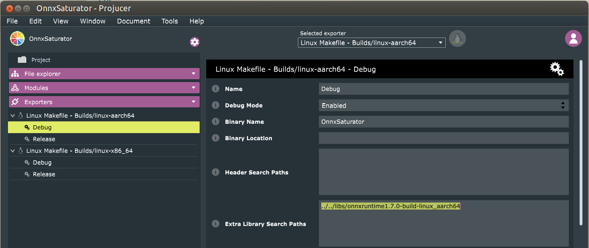

# Real-Time Embedded Deep Learning Deployment for Elk Audio OS

This guide contains a more detailed and up to date version of the instructions provided in the paper:  
  
*Domenico Stefani, Luca Turchet **"A Guide to Real-Time Embedded Deep Learning Deployment for Elk Audio OS"** in International Symposium on the Internet of Sounds (IS<sup>2</sup>), Pisa, Italy Oct 2023 (Accepted)*

The paper will soon be available [here](https://domenicostefani.com/phd_research.html#2023IS2-Guide)

## Contents

1. [Tools](#tools)  
    1.1. [JUCE and VST](#juce-and-vst))  
    1.2. [Elk Audio OS](#elk-audio-os)  
    1.3. [Choice of Inference Engine](#choice-of-inference-engine)  
    1.4. [Project's Repository](#project's-repository)  
2. [Stepwise deployment procedure](#stepwise-deployment-procedure)  
    2.1. [JUCE VST plugin creation](#juce-vst-plugin-creation)  
        2.1.1. [Templates](#templates)  
        2.1.2. [Manual Creation](#manual-creation)  
    2.2. [Cross-compilation for Elk Audio OS](#cross-compilation-for-elk-audio-os)  
        2.2.1. [Dependencies Compilation](#dependencies-compilation)  
        2.2.2. [Plugins Compilation](#plugins-compilation)  
    2.3. [Elk Audio OS on the Raspberry](#elk-audio-os-on-the-raspberry)  
    2.4. [DAW configuration: Sushi](#daw-configuration:-sushi)  
    2.5. [Diagnostic tools](#diagnostic-tools)  


## Tools

### JUCE and VST

[JUCE](https://github.com/juce-framework/JUCE) is a cross-platform framework for audio plugins and applications.
It is a C++ framework with a dual license (i.e., GPLv3 open-source and
commercial). JUCE embeds the VST3 SDK and Elk Audio provides support and
instructions on how to build a JUCE plugin for their OS. The procedure
reported in this guide was tested with JUCE 6 (version 6.0.7).

### Elk Audio OS

[Elk Audio OS](https://elk-audio.github.io/elk-docs/html/index.html) is an embedded operating 
system optimized for low-latency audio processing on embedded hardware.  
Currently, Elk offers a disk image and a cross-compilation SDK for the 
Raspberry Pi 4 single-board computer, and
more hardware platforms (see the [docs](https://elk-audio.github.io/elk-docs/html/intro/supported_hw.html)) under a commercial license. Moreover, up
to Elk Audio OS version `0.7.2` Raspberry Pi 3 was supported. The
instructions in [the paper connected to this guide](https://domenicostefani.com/phd_research.html#2023IS2-Guide) refer to version `0.11.0`. Nevertheless, we will try to keep the
online repository and this guide updated with the latest version of the OS. 

### Choice of Inference Engine

Inference of deep learning
models is the process of running an input through the network and
executing all the computations required to produce an output prediction.
deep learning models are
generally trained and tested in powerful server machines or PCs, using
high-level programming languages (e.g., Python) and
deep learning frameworks (e.g.,
PyTorch, TensorFlow). Training through backpropagation is a particularly
compute-intensive task that often requires specialized acceleration
hardware and drivers (e.g., CUDA GPUs or TPUs). On the contrary,
inference is considerably less computationally expensive and can be
optimized for deployment.

In recent years, deep learning
framework companies and developers have focused on in-device inference
for edge and mobile computing. In Internet of Things (IoT), edge computing has the great advantage
of performing relevant computations closer to where input data is
gathered. Even more so, embedded in-device inference can be advantageous
in terms of action-to-reaction latency, since inference computations can
be performed right at the place where the inputs are gathered through
sensors, which is devoid of the latency of communication with one or
more cloud servers. While in-device computation can have marginal
advantages in some IoT, it is an indisputable requirement of
music performance tools and many e Internet of Musical
Things (IoMusT) systems, even when the learning task
allows for slightly more lenient time constraints than audio-rate
deadlines (See [[Stefani, 2022a]](https://domenicostefani.com/phd_research.html#2022DAFX-2-Challenges)). For this reason, several C and C++ libraries known as inference engines were made
available along with most deep learning frameworks, to allow for efficient and
quick inference, especially for resource-constrained embedded devices.

Our previous work [[Stefani, 2022b]](https://domenicostefani.com/phd_research.html#2022DAFX-1-Comparison) compared the performance and
suitability of four of these engines (i.e., TensorFlow Lite, ONNX
Runtime, Torch+Torchscript, and RT Neural) for audio tasks on a
Raspberry Pi 4 running Elk Audio OS. While exact execution time can
depend on a specific model, ONNX Runtime and TensorFlow Lite have been
shown to be very quick, well-documented, and easy to use. For the code
templates in the repository of this guide, we decided to
include separately both Tensorflow Lite and ONNX runtime because
TensorFlow users will find it extremely easy to export their model for
the former, while models from most frameworks can also be converted to
the ONNX including [PyTorch](https://pytorch.org/docs/stable/onnx.html) too. Support for ONNX runtime is
particularly relevant as a large part of research on black-box audio
effect emulation is currently carried out using Pytorch and PyTorch-to-TensorFlow 
model-conversion is not a straightforward process.

For TensorFlow developers, we suggest choosing the TensorFlow Lite
template code, while PyTorch and other developers should convert their
models to ONNX and use ONNX Runtime.

### Project's Repository

This guide is intended help to successfully deploy
deep learning models to
embedded devices running Elk Audio OS and perform inference. While the
steps described in the next section cover all the required actions, from
project creation to a running plugin on an embedded system, we provide
clean source code *templates*, working *examples*, and *inference engine
binaries* in order to reduce the effort required for deployment. This
substantial addition to the written part of this guide is contained in
the `elk-audio-AI-tutorial` repository on the GitHub page of the  Creative, Intelligent &
Multisensory Interactions Laboratory (CIMIL)](https://github.com/CIMIL/elk-audio-AI-tutorial/). Additionally, the online repository
will serve as an up-to-date version of the guide, addressing potential
changes in the new version of Elk Audio OS or inference engines.

## Stepwise deployment procedure

This section presents the stepwise procedure to deploy a
deep learning model to a
Raspberry Pi running the Elk Audio OS. This guide can also be followed
for deployment to a VST plugin (ignoring cross-compilation and
device-specific steps) for any platform, including Windows, MacOS, and
x86-64 Linux. All the code and library binaries required to follow the
guide are provided at the project repository, and they will allow readers to
skip parts of the guide for easier deployment (e.g., library compilation
can be skipped if using the provided binaries). Further updates,
improved instructions, and additional inference engines will be added to
the repository.

Instructions assume the use of a Unix-based OS and were tested on Linux
x86-64 (i.e. Ubuntu 20.04.6 LTS), but they can be followed using MacOS
systems and Windows with the [Windows Subsystem for Linux (WSL)](https://learn.microsoft.com/en-us/windows/wsl/install) or a virtual machine.
Both WSL
version 1 and 2 should be suitable, but it may be necessary to
enable X11 forwarding to use the graphical version of the Projucer
app.  
As mentioned
previously, the instructions in this guide refer to version 0.11.0 of
Elk Audio OS, but the online code repository will be updated with new
versions of the OS. Moreover, we use *JUCE 6* (version 6.0.7), the
*Projucer* app to handle build configuration, and *Linux Makefile* as
the build system.
[Figure 1](#deployment-diagram) shows an overview of the entire deployment
process.

## Deployment diagram

*Figure 1: Diagram depicting the process of deploying a deep learning model to an embedded device running Elk Audio OS. Plugin and dependency compilation happens on a Host computer (top left), where the Elk-PI toolchain allows to cross-compile the source code. Library binaries are linked during plugin compilation, which produces the binary file for a VST plugin that can execute on the target device (right). The compiled plugin has to be moved to the embedded computer running Elk Audio OS, where Elk's DAW Sushi can be configured to load it into a new track and process audio in real-time. The lower part represents the training, testing, and model export phases required for either TensorFlow or frameworks that export to the ONNX format, such as Pytorch. Dashed arrows labeled as 1 and 2 represent two distinct options for model integration: in option 1 the deep learning model gets integrated as JUCE BinaryData into the plugin's binary, while for option 2 the model can be simply copied to the device. For the latter, the plugin code must load the model from a path relative to the target's folder structure.*


The next sections will describe the following steps:

1. [Creation of a JUCE project for deep learning deployment on Elk Audio OS](#juce-vst-plugin-creation);
2. [Cross-compilation of a plugin and its dependencies](#cross-compilation-for-elk-audio-os);
3. [Installation and communication with Elk Audio](#elk-audio-os-on-the-raspberry);
4. [Configuration of Elk's DAW](#daw-configuration-sushi) ;
5. [Troubleshooting](#diagnostic-tools);

### JUCE VST plugin creation

JUCE plugins can be created using the Projucer app, which is provided
with any JUCE distribution. The Projucer handles the configuration of
the project, its export formats, and its build systems along with their
different configurations (i.e., *exporters*). Moreover, it takes care to
create the build files for each exporter whenever the project is saved
in the Projucer app. Additionally, it can execute a user-defined command
every time a project is saved (post-export Shell command). It is also
possible to use CMake to set up JUCE projects, but this will not be
covered by the written guide.

The following two alternatives can be used to create and customize a
JUCE project to compile VST plugins that will be compatible with Elk
Audio OS:

-   Use of one of the provided templates;
-   Manual project creation.

#### Templates

The project repository contains template projects for ONNX
runtime and TensorFlow Lite. These include the precompiled dependencies
and a project configuration (`.jucer` file). The project configuration file
ensures that the relative inference library is correctly linked, headers
are included and it creates a cross-compilation script for Elk Audio OS.

The user should open the `.jucer` file with the Projucer and save the project to
create the build folder structure. To use the template as a starting
point for their project, users may want to rename the Plugin and project
itself: this can be achieved by opening the `.jucer` file with a text editor with
the search-and-replace function and substituting all the occurrences of
the original name (e.g., ONNXrt-VST-template) with the new name. After
each change, the file should be opened with the Projucer app and saved.
Users are expected to modify the template code that loads an inference
model and executes inference depending on their needs and according to
the documentation of each engine ([TFlite](https://www.tensorflow.org/lite/guide/inference#load_and_run_a_model_in_c), [ONNX-rt](https://onnxruntime.ai/docs/get-started/with-cpp.html)).

Notably, even if Elk Audio OS only handles headless plugins (i.e.,
without a Graphical User Interface (GUI)) for
optimized latency, it is not necessary to remove any
GUI code from the
plugin editor, as the graphic routines will simply not be called by the
Sushi DAW.

#### Manual Creation

The steps needed for manually creating a JUCE project for a
VST plugin that is
compatible with Elk Audio OS are the following:

1. Open the Projucer app and create a new Audio Plugin project

2. Edit settings (View \> Show Project Settings):
    
    1. Set VST3 or VST legacy as Plugin Formats (Specify VST legacy
        only if in possession of the now discontinued VST2 SDK, which
        should eventually be linked in File \> Global Paths);
    
    
    2. Add header folder paths for the inference engine and other
        dependencies in the *Header Search Paths* field. Paths are
        relative to the `Builds/<exporter-name>/` folder;
    
3. Disable `JUCE_WEB_BROWSER` in the *juce_gui_extra module* (in the Modules panel, on the
    left of the Projucer window);
    
4. Create a Linux Makefile exporter (Exporters panel):
    1. Click the plus icon to create the exporter and specify Linux
        Makefile;
        
    2. On the main Linux Makefile exporter panel (click on the
        explorer) add the name of the libraries to include in the
        *External Libraries to Link* (e.g., `onnxruntime` , to include the binary `libonnxruntime.so`);
        
    3. On all the configuration panels (e.g., Debug and Release) add
        the paths to the included libraries. Paths are relative to the `Builds/<exporter-name>/`
        folder. Make sure that the path leads to a version of the
        library binary compiled for the target architecture
        Linux-aarch64. Refer to the section on [dependencies compilation](#dependencies-compilation)};
        
5. Save the project to create the build directory structure and
    Makefiles.
6. Manually add a cross-compile script to the `Build/<exporter_name>` folder. See
    the section on TODO for a
    description of what the script should include, or copy the `compileForElk.sh` script
    that gets automatically generated by the post-export command in the
    template projects.

As stated above, it is not necessary to remove any
GUI code from the
project.

### Cross-compilation for Elk Audio OS

Deploying any plugin to Elk Audio OS (especially for Raspberry Pi and
resource-constrained devices) will generally involve cross-compilation.
Cross-compilation is a technique by which source code is compiled with a
cross-compiler on a **host** computer, resulting in a binary file that
is executable on a **target** computer with an architecture different
from that of the host. This enables the compilation of binary
executables for embedded devices from a different machine architecture
which can take advantage of more powerful hardware. While native
compilation on the Raspberry Pi is possible, it is discouraged as
anything other than the last resort due to the constrained resources
available, thus long computation times (i.e., tens of hours for most
engines). In the case of this guide, the **host** is an x86-64 Linux
computer, while the target is an ARM 64bit single-board computer (aarch64 architecture), running the
Linux-based real-time Elk Audio OS. To cross-compile any program for a
Raspberry Pi with Elk Audio OS, the Elk-PI SDK corresponding to the OS
version of choice should be installed and used (see the [releases](https://github.com/elk-audio/elkpi-sdk/releases)).

**It is not necessary** to follow the next step (i.e., *Dependencies
Compilation*) to compile a project that depends only on the inference
library of choice, as the pre-compiled binaries are included in the
project repository.

#### Dependencies Compilation

To cross-compile a plugin, any eternal dependency needs to be compiled.
In the case of a simple plugin that integrates deep-learning inference, the sole direct dependency
will be the inference engine library (e.g., TensorFlow Lite or ONNX
runtime). Additionally, each direct dependency may have sub-dependencies
that might need to be included for compilation (See TensorFlow Lite
template in the project's repository).

Cross-compilation of the dependencies is complex and not always
possible. It can be hard to set up cross-compilation, especially for
libraries that were not prepared for it, that are not well documented,
or that use less known build systems. Libraries that rely on [CMake](https://cmake.org/)
can be integrated reasonably well with Elk's toolchain. The main steps
for cross-compilation of these libraries are the following:

1. Downloading and installing the Elk-PI SDK;
2. Downloading the library source code for the desired version;
3. Creating a `build` folder;
4. Resetting `LD_LIBRARY_PATH` and sourcing the Elk-PI SDK;
5. Executing CMake from the build directory: `cmake path/to/CMakeLists/dir/`;
6. Compiling with `make`

A working example can be found in the repository for this project for the TensorFlow Lite template.
The example shows how the actual compilation procedure can deviate from
the ideal process, due to peculiar characteristics of some
sub-dependencies or bugs. In particular, for TensorFlow Lite 2.11.0 it
is necessary to change the version of the dependency `FlatBuffers` from 2.0.6 to 2.0.8
and overwrite the `CMAKE_SYSTEM_PROCESSOR` variable. This build variable is set to `cortexa72` by Elk
toolchain, but the `Abseil` dependency requires `aarch64` to avoid incorrect library
linking. Both corrections were informed by comments in the Issues
section of the Abseil and TensorFlow GitHub repositories (see [this](https://github.com/abseil/abseil-cpp/issues/365) and [this](https://github.com/google/flatbuffers/issues/7297#issuecomment-1207311095)), which were
consulted by searching for specific error messages produced by failed
compilation runs. A similar informed trial and error procedure can be
followed for other libraries.
The following code snippet shows the compilation script for TensorFlow Lite.

```
git clone https://github.com/tensorflow/tensorflow.git
cd tensorflow
git checkout v2.11.0
mkdir -p build-aarch64 && cd build-aarch64

sed -i 's/GIT_TAG v2.0.6/GIT_TAG v2.0.8 #https:\/\/github.com\/tensorflow\/tensorflow\/issues\/57617/g' \
    ../tensorflow/tensorflow/lite/tools/cmake/modules/flatbuffers.cmake

unset LD_LIBRARY_PATH
source /opt/elk/0.11.0/environment-setup-cortexa72-elk-linux

cmake ../tensorflow/tensorflow/lite -DTFLITE_ENABLE_XNNPACK=OFF -DCMAKE_TOOLCHAIN_FILE=../toolchain.cmake

export CXXFLAGS="-O3 -pipe -ffast-math -feliminate-unused-debug-types -funroll-loops"

AR=aarch64-elk-linux-ar make -j$(nproc) CONFIG=Release CFLAGS="-Wno-psabi" \
    TARGET_ARCH="-mcpu=cortex-a72 -mtune=cortex-a72"
```

This sequence of commands is required to properly download the TensorFlow source code for version 2.11.0 and cross-compile TensorFlow Lite for Elk Audio OS and the Raspberry Pi4. The `sed` command represents an example of deviation from the theoretical cross-compilation procedure mentioned in  the section about [dependencies-compilation](#dependencies-compilation), as it is required to fix a compilation bug. It does so by changing the version of the sub-dependency Flatbuffers to include from 2.0.6 to 2.0.8. Additionally, the `toolchain.cmake` provided in the project's repository sets the value of the `CMAKE_SYSTEM_PROCESSOR` variable to `aarch64` to address a bug with the sub-dependencies Abseil and Cpuinfo.

When cross-compilation is more difficult to set up, compilation can be
performed on the Raspberry Pi, at the expense of compilation time. For
this process, it is suggested to extend the *userdata* partition in the
Elk-Pi SD card (e.g., using the [GParted program](https://gparted.org/) on a different
computer), boot the Elk-Pi board, clone or download the library source
code to `/udata/`, and follow the build instructions of the specific library for
any Linux system. This may require compiling other sub-dependencies
separately, in case they are not included in Elk Audio OS, or
automatically fetched during compilation setup. This was the case for
ONNX runtime, whose compilation required a few tens of hours on the
board, and for which the compiled binary is provided in the repository
of this project.

Whenever a dependency compiles to a dynamic library (i.e. `*.so` files), the
binary is needed both at linking time (on the host computer) and at
execution time (on the board), when the library is loaded dynamically.
This means that the compiled `.so` binary for any dependency must be copied to
the board, and placed in one of the system library paths (Run `echo $LD_LIBRARY_PATH` on the
device to find dynamic loading paths). Alternatively, if placed in any
other directory, the folder containing the binary should be appended
after each reboot, either manually or automatically, to the `LD_LIBRARY_PATH` system variable as follows:

```
export LD_LIBRARY_PATH=$LD_LIBRARY_PATH:/libpath/
```

The export line can be added to the `~/.bashrc` or `/etc/profile` text file for automatic execution.

On the contrary, static libraries (i.e., `*.a` files) are automatically
included in the plugin binary and do not need to be copied to the board.

#### Plugins Compilation

Once the inference engine and other libraries required are compiled and
properly added to the compilation exporter (see Projucer configuration
in the project repository), the plugin can be compiled
multiple times without re-compiling dependencies.

Assuming a correct Projucer setup, the steps for plugin compilations are
the following:

1. Saving the project from the Projucer app, to create the build
    structure;
2. Opening the terminal in the `/build/linux-aarch64` folder;
3. Resetting `LD_LIBRARY_PATH`;
4. Sourcing the Elk-PI SDK;
5. Compiling with `make`, specifying `JUCE_HEADLESS_PLUGIN_CLIENT=1`;
6. For VST3 plugins, renaming the `PluginName.vst3/Contents/arm64-linux`
    folder to `aarch64-linux`.

Additionally, before the `make` command, the user can specify additional
optimization flags such as the following:

```
export CXXFLAGS="-O3 -pipe -ffast-math -feliminate-unused-debug-types -funroll-loops"
```

The following is a simplified compilation script for any plugin project.

```
unset LD_LIBRARY_PATH

source /opt/elk/0.11.0/environment-setup-cortexa72-elk-linux

export CXXFLAGS="-O3 -pipe -ffast-math -feliminate-unused-debug-types -funroll-loops"

AR=aarch64-elk-linux-ar make \
-j$(nproc) CONFIG=Release\
CFLAGS="-DJUCE_HEADLESS_PLUGIN_CLIENT=1 -Wno-psabi"\
TARGET_ARCH="-mcpu=cortex-a72 -mtune=cortex-a72"
```

### Elk Audio OS on the Raspberry

Elk Audio OS v0.11.0 is available as open source for the Raspberry Pi 4
board (see the [repository](https://github.com/elk-audio/elk-pi/releases)), while older versions support also the Raspberry Pi 3. More
single-board computers are supported
under a commercial license. The OS image should be downloaded from the
GitHub repository and flashed to a good-quality SD card. The Raspberry
Pi must be coupled with an audio *"hat"* board supported by the OS, such
as the HiFiBerry DAC+ ADC and HiFiBerry DAC+ ADC Pro boards.

Once an audio hat board is connected to the Raspberry Pi and the OS SD
is inserted, the board should be powered on and the user can access the
terminal either using a monitor connected via HDMI or with a remote
Secure SHell (SSH) connection. Elk
Audio OS does not have a GUI and requires the user to control it via
terminal, or via network (e.g., using the gRPC or Open Sound Control (OSC) protocols). For remote access to the
terminal, the board can be connected via an ethernet cable to either a
network router or a computer directly. After the first successful
access, the terminal can be used to connect the board to a Wifi network
if desired. The default hostname for Elk-Pi boards is `elk-pi.local` and it can be used
to identify the board in a local network. To ensure that the board is
connected, use the `ping` command as follows and wait for a positive reply:

```
ping elk-pi.local
```

The `arp -a` command on a Linux terminal can be useful to find the board IP
address if the hostname is not reachable. Then, the
SSH protocol can be
used to access the terminal remotely. The `ssh` command is available on Linux,
MacOS, and the latest Windows 10 and 11 terminals (PowerShell). For
previous versions of Windows or PowerShell, SSH clients such as [Putty](https://www.putty.org/) can be used to
replace remote terminal and copy functions. The board can be accessed
via the terminal with the following command:

```
ssh mind@elk-pi.local
```

The default password is `elk` .

Once a connection is made, files such as the compiled Plugin,
configuration files, and dynamic libraries can be copied to the board
using `scp` (see [scp](https://linux.die.net/man/1/scp)) from the host computer:

```
scp -r /path/to/PluginName.vst3 mind@elk-pi.local:~/
scp libonnxruntime.so mind@elk-pi.local:~/
```

### DAW configuration: Sushi

Once a VST plugin is
copied to the board, it can be hosted via Elk Audio OS's
DAW Sushi.
Similarly to other DAWs, Sushi allows the creation of multiple
tracks, where each can have one or more audio and MIDI inputs and
outputs. Each track can have a chain of plugins, which are loaded as a
dynamic library at runtime. However, differently from most other
DAWs, the
GUI code of the
hosted plugins is neither shown nor called by Sushi, and the audio
processing callback is executed on a hard real-time Xenomai thread for
low latency processing.

For these reasons, executing the plugin prepared in the previous steps
requires the configuration and execution of Sushi. Configurations are
prepared in the form of JSON files. The following is a configuration
file that will prompt Sushi to create a mono track with a single audio
input and output, and to load the VST3 plugin "PluginName":

```
{
  "host_config":{
    "samplerate":48000
  },
  "tracks":[
    {
      "name":"main",
      "mode":"mono",
      "inputs":[
        {
          "engine_channel":1,
          "track_channel":0
        }
      ],
      "outputs":[
        {
          "engine_channel":1,
          "track_channel":1
        }
      ],
      "plugins":[
        {
          "uid":"PluginName",
          "path":"/path/to/vst/PluginName.vst3",
          "name":"arbitrary_plugin_name",
          "type":"vst3x"
        }
      ]
    }
  ],
  "midi":{
    "cc_mappings":[]
  }
}
```

In particular, the *uid* field should match exactly the VST3 unique
identifier, which for JUCE corresponds to the project name (e.g.,
PluginName for PluginName.vst3). Alternatively, for VST2 plugins, the
plugin block in the JSON configuration should contain only the
following:

```
"path":"/path/to/vst/PluginName.so",
  "name":"arbitrary_plugin_name",
  "type":"vst2x"
```

Moreover, the configuration for a stereo track should use the following `mode`, `inputs`, and `outputs` field values:

```
"mode":"stereo",
"inputs":[ {
    "engine_bus":0,
    "track_bus":0
  } ],
"outputs":[ {
    "engine_bus":0,
    "track_bus":0
  } ]
```

More configuration file examples are provided in the project repository.

Once a configuration file is prepared, Sushi must be executed via the
terminal by providing the audio driver type and the configuration file
path:

```
sushi -r -c "/path/to/config.json"
```

where the `-r` option specifies to use Elk's RASPA low-latency front-end.
Users can add more options such as `-multicore-processing=2` to allow Sushi to use more cores.
Moreover, `&` can be added at the end of the command to start Sushi in
the background and keep using the terminal. The background execution can
later be stopped with `pkill sushi`. If Sushi fails to start, errors in the
configuration or plugin can be identified in the log file `/tmp/sushi.log`. The next
section will provide a brief overview of diagnostic tools.

### Diagnostic tools

By default, Sushi logs events and errors at run-time to the file `/tmp/sushi.log`. The
logging level can be changed using thee `-l` flag. The log can show errors
such as having a plugin uid that does not match the actual VST3
unique-id or having an incorrect configuration format. Additionally, the `-timing-statistics` flag will prompt Sushi to log the fraction of CPU time available used
for processing. This is particularly relevant for
deep learning models meant to
be executed in real-time, with one or more inference operations per
audio block, as this will show if the plugin is reaching the allotted
time budget for each call or even surpassing it. The next section will
present a brief overview of different execution modes, including a few
considerations on how to deal with real-time tradeoffs and large models.

Notably, Elk Audio OS provides tools to diagnose real-time execution
issues since any part of the code that is meant to execute in real-time
must respect specific real-time safe programming
rules [@bencina2014interfacing]. These rules include not allocating
memory dynamically from the audio thread, not using locking mechanisms
for concurrent memory access, or not waiting on lower-priority threads
(e.g., querying system timers). In general, these rules can be
summarized as "do not perform (on the audio thread) operations that have
unbounded or unknown completion time". The inference libraries included
were tested [@stefani2022comparison] and deemed real-time safe, but user
code that is added to a plugin should respect the same rules.

Being Elk Audio OS a system based on a dual kernel, with audio
processing running on Xenomai real-time threads, it can be
straightforward to verify whether user code is violating real-time
safety and troubleshoot the problem. In fact, in Elk Audio OS, non-safe
operations in the audio callback will result in a **mode switch**, i.e.,
the system will give control back to the regular Linux kernel to handle
the unsafe operations and switch back to the Xenomai kernel. Up to
version 0.11.0 of Elk Audio OS, mode switches can be monitored by
looking regularly at the `MSW` column in the `/proc/xenomai/sched/stat` file. The following command will
update its output every three seconds:

```
watch -n 3 cat /proc/xenomai/sched/stat
```

Version 1.0.0, which was released while this guide was being finalized,
requires using the `evl ps -s` command instead and looking at the `ISW` counter.

The number of mode switches must remain stable after the plugin startup,
with one or two mode switches being allowed at startup if not audible as
artifacts. In the case of repeated mode switches, their origin can be
traced back to the original source code using the gdb debugger as
follow:

1. Running the GNU Debugger `gdb` on the sushi executable for the current
    block size (default 64):
    ```
    gdb sushi_b64
    ```
2. Setting `gdb` to stop whenever the `SIGXCPU` signal is sent by the program:
    ```
    catch signal SIGXCPU
    ```
3. Running Sushi with the debug-mode-sw flag:
    ```
    r -r --debug-mode-sw -c config.json
    ```

Finally, the [Elk Audio forum](https://forum.elk.audio/) can be a useful source to find support and solve similar problems.

## Bibliography

[[Stefani, 2022a]](https://domenicostefani.com/publications/2022DAFX_2_Challenges.pdf) D. Stefani and L. Turchet, “On the Challenges of Embedded Real-Time
Music Information Retrieval,” in Proceedings of the 25-th Int. Conf. on
Digital Audio Effects (DAFx20in22), vol. 3, Sept. 2022, pp. 177–184.  
[BibTeX](data/challenges.bib)

[[Stefani, 2022b]](https://domenicostefani.com/publications/2022DAFX_1_Comparison.pdf) D. Stefani, S. Peroni, and L. Turchet, “A comparison of deep learning inference engines for embedded real-time audio classification,” in
Proceedings of the Digital Audio Effects Conference, 2022.
[BibTeX](data/comparison.bib)

*26th of September 2023*  
*Domenico Stefani*